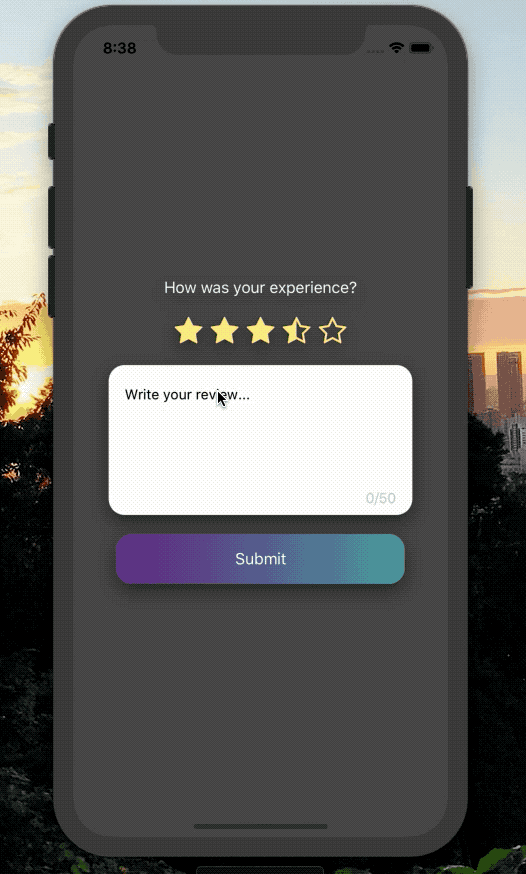

Simple and easy to use TextArea for React Native.

[](https://www.npmjs.com/package/react-native-text-area)
[](https://www.npmjs.com/package/react-native-text-area)

[](https://opensource.org/licenses/MIT)
[](https://github.com/prettier/prettier)

<p align="center">

</p>

## Installation

Add the dependency:

### React Native:

```js
npm i @freakycoder/react-native-text-area
```

## Peer Dependencies

###### IMPORTANT! You need install them.

```js
"react": ">= 16.x.x",
"react-native": ">= 0.55.x",
```

## Basic Usage

```js
import TextArea from "react-native-text-area";

<TextArea
  maxCharLimit={50}
  placeholderTextColor="black"
  exceedCharCountColor="#990606"
  placeholder={"Write your review..."}
/>;
```

## Configuration - Props

| Property             |  Type  |    Default     | Description                               |
| -------------------- | :----: | :------------: | ----------------------------------------- |
| styles               | style  | check the code | set your own style                        |
| backgroundColor      | color  |   "#fbfbfb"    | change the TextArea's background color    |
| charCount            | number |       0        | set the current character count           |
| maxCharLimit         | number |      200       | set the maximum character count limit     |
| charCountColor       | color  |     "#ccc"     | change character count's color            |
| exceedCharCountColor | color  |     "red"      | change the exceeded character count color |

## Author

FreakyCoder, kurayogun@gmail.com

## License

React Native Text Area Library is available under the MIT license. See the LICENSE file for more info.
